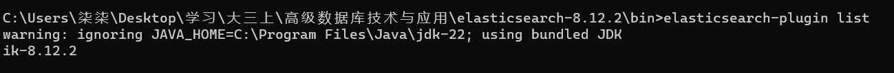

# 实验2 索引&文档操作

班级：软工2203 指导老师： 丁玺润

学号：2200770114

姓名：焦买涛
***
实验内容：
1. Elasticsearch 安装IK分词器
2. Elasticsearch 索引操作训练
3. Elasticsearch 文档操作训练
4. Elasticsearch 高级查询与DSL训练

实验目标：

1. 掌握Elasticsearch 安装IK分词器安装方法
2. 掌握Elasticsearch 索引操作方法
3. 掌握Elasticsearch 文档操作训练
4. Elasticsearch 高级查询与DSL训练

作业内容：

1. 完成任务一
2. 完成任务二
3. 完成任务三


## 实验具体内容
### 前置任务 
1.Elasticsearch 安装IK分词器

这里有俩种安装方式，一种是本地下载包植入安装，另一种是通过指令远程URL安装，在这里我选择本地下载包安装。

词器的包资源 [ik分词器](elasticsearch-analysis-ik-8.12.2.zip)

下载好之后解压到elasticsearch-8.12.2\plugins路径下


然后重启观察Elasticsearch 会显示加载了刚才解压的插件

也可以通过ES的bin下的elasticsearch-plugin.bat查看安装的插件
```elasticsearch-plugin list```

显示以下即可安装成功


### 任务1 索引操作练习
要求：能够根据字段描述，创建索引，修改索引，删除索引

任务一：
1. 创建索引
2. 修改索引(自己设计，修改要合理）
3. 删除索引
4. 查看所有
