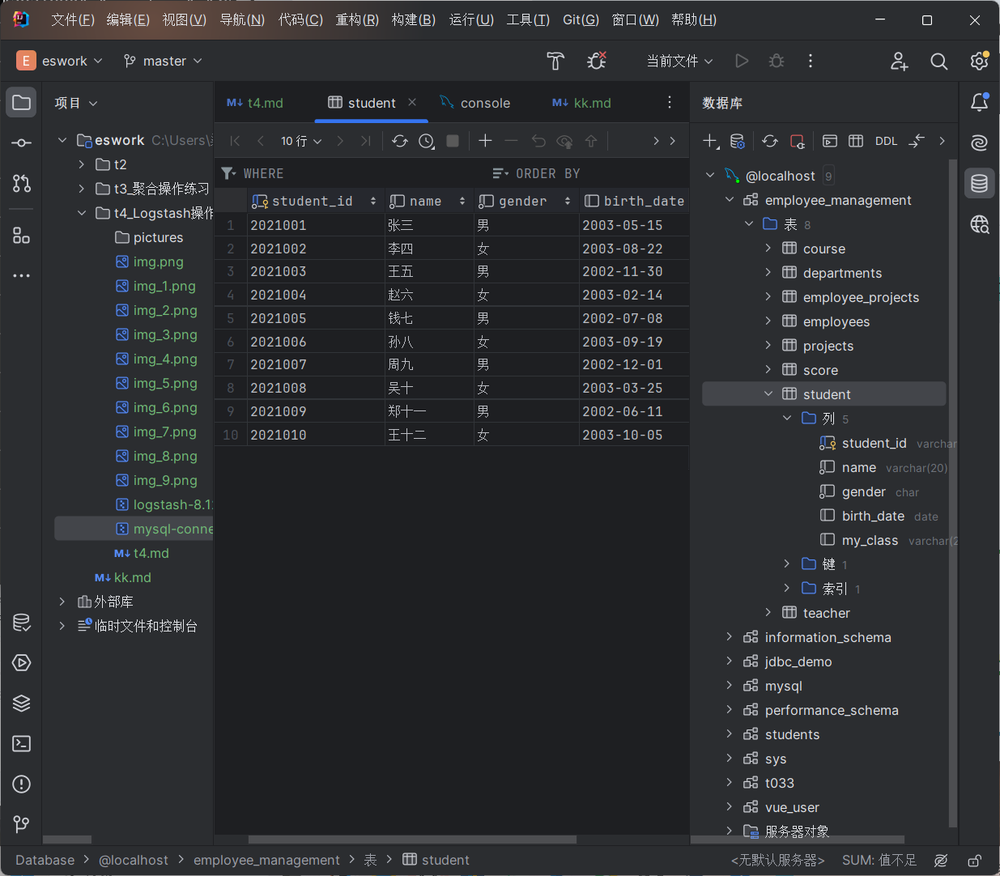
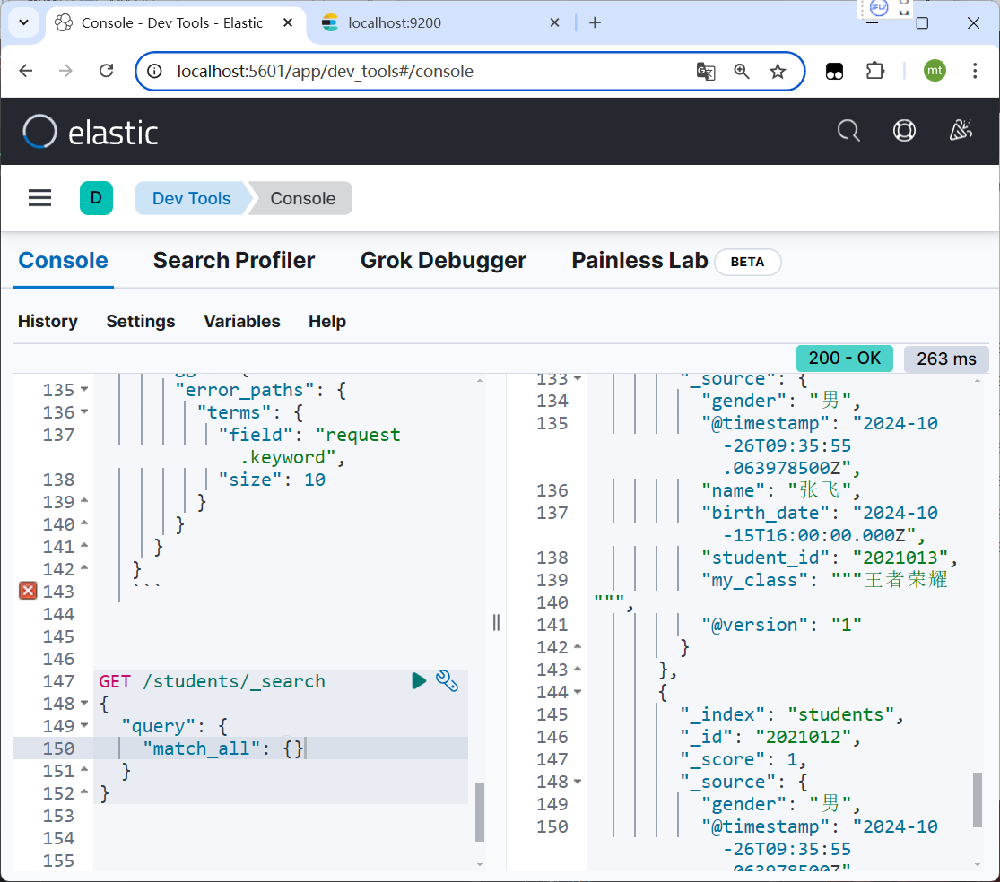

学院：省级示范性软件学院

课程：高级数据库技术与应用

题目：《 实验四 Logstash操作》

姓名：焦买涛

学号：2200770114

班级：软工2203

日期：2024-10-21

实验环境： kibana-8.12.2  elasticsearch-8.12.2  Windows11  logstash-8.12.2


*** 

# 实验四 Logstash操作

## 一、实验目的

* 掌握Logstash 操作

## 二、实验内容

* Logstash 操作练习


### 1.1. tomcat日志处理

**数据来源：** 本地的tomcat的logs中的日志或使用下面的文件

**要求：**
1. 将tomcat的logs中的localhost_access_log访问日志导入到本地的elasticsearch中。
2. 数据导入到一个名为tomcat_logs的索引。
3. 在elasticsearch中做5个日志相关的分析，题目自拟。（提示：可以参考第04章聚合操作日志实战内容）


先是启动kibana和es


然后在下载解压好好的logstash[logstash-8.12.2-windows-x86_64.zip](logstash-8.12.2-windows-x86_64.zip)目录下的logstash-8.12.2\config新建一个.conf文件，写入内容

```
input {
  file {
    path => "D:/gjsjk/logstash-8.12.2/tomcat_logs/localhost_access_log.*.txt"  # 日志文件的路径，使用通配符匹配所有相关文件
    start_position => "beginning"  # 从文件的开头开始读取
    sincedb_path => "D:/gjsjk/logstash-8.12.2/tomcat_logs/sincedb"  # 存储文件读取位置的数据库路径
    codec => "plain"  # 指定文件的编码方式
  }
}

filter {
  grok {
    match => { "message" => "%{IP:client} - - \[%{HTTPDATE:timestamp}\] \"%{WORD:method} %{URIPATH:request} HTTP/%{NUMBER:http_version}\" %{NUMBER:response} (?:%{NUMBER:bytes}|-)" }
  }
  date {
    match => ["timestamp", "dd/MMM/yyyy:HH:mm:ss Z"]
    target => "@timestamp"
  }
}
output {
  elasticsearch {
    hosts => ["http://localhost:9200"]  # Elasticsearch地址
    index => "tomcat_logs"  # 索引名称
  }
  stdout { codec => rubydebug }  # 输出到控制台，便于调试
}
```

path请自己指定

然后在logstash-8.12.2\bin目录下打开终端


输入```logstash -f "D:\gjsjk\logstash-8.12.2\config\logstash.conf"```

f后面的路径请自定。


检查上面的内容乱不乱，乱的话进行微调（必须要让filter符合后续的查询要求）


随后打开dev tool工具进行验证查询，一般出错的话需要重新启动logstash，先关闭再删除logstash-8.12.2\tomcat_logs\sincedb文件，再启动，保证重新读入。


以下是在Kibana的Dev Tools中执行的完整查询代码，五个日志分析：

1. **最常访问的URL路径分析**
   ```json
   GET /_search
   {
     "size": 0,
     "aggs": {
       "top_paths": {
         "terms": {
           "field": "request.keyword",
           "size": 10
         }
       }
     }
   }
   ```


2. **HTTP响应状态码分布分析**
   ```json
   GET /_search
   {
     "size": 0,
     "aggs": {
       "response_codes": {
         "histogram": {
           "field": "response",
           "interval": 1
         }
       }
     }
   }
   ```


3. **按天统计的请求量分析**
   ```json
   GET /_search
   {
     "size": 0,
     "aggs": {
       "requests_per_day": {
         "date_histogram": {
           "field": "@timestamp",
           "calendar_interval": "day",
           "time_zone": "+08:00"
         }
       }
     }
   }
   ```


4. **客户端IP地址活跃度分析**
   ```json
   GET /_search
   {
     "size": 0,
     "aggs": {
       "top_clients": {
         "terms": {
           "field": "client.keyword",
           "size": 10
         }
       }
     }
   }
   ```


5. **错误日志分析**
   ```json
   GET /_search
   {
     "query": {
       "range": {
         "response": {
           "gte": 400,
           "lte": 599
         }
       }
     },
     "aggs": {
       "error_paths": {
         "terms": {
           "field": "request.keyword",
           "size": 10
         }
       }
     }
   }
   ```


### 1.2. 数据转换和传输

* 要求：
1. 将本地的mysql数据库中的一张表导入到本地的elasticsearch中。
2. 数据库表更新后，数据能够自动同步到elasticsearch中。

要完成这两个任务，您可以使用Logstash进行数据导入和同步。Logstash可以连接到MySQL数据库，读取数据，并将其索引到Elasticsearch中。同时，您可以配置Logstash以监听数据库的变更，实现数据的自动同步。

### 将MySQL表导入Elasticsearch

首先，需要安装Logstash并配置一个Logstash配置文件，该文件将连接到MySQL数据库，并将数据导入到Elasticsearch中。

1. **安装JDBC驱动**：
   需要MySQL的JDBC驱动来让Logstash能够连接到MySQL数据库。下载JDBC驱动，并将其放置在Logstash的`lib`目录下。

[mysql-connector-j-9.1.0.zip](mysql-connector-j-9.1.0.zip)


然后将就使用上次的数据库employee_management


student表


2. **创建Logstash配置文件**：
   创建一个名为`mysql_to_elasticsearch.conf`的文件，内容如下：

```
input {
  jdbc {
    jdbc_driver_library => "D:\gjsjk\logstash-8.12.2\lib\mysql-connector-j-9.1.0\mysql-connector-j-9.1.0.jar"
    jdbc_driver_class => "com.mysql.cj.jdbc.Driver"
    jdbc_connection_string => "jdbc:mysql://localhost:3306/employee_management"
    jdbc_user => "root"
    jdbc_password => "1234"
    statement => "SELECT * FROM student"
    schedule => "*/5 * * * * *" # 每5秒运行一次
  }
}

output {
  elasticsearch {
    hosts => ["http://localhost:9200"]
    index => "students"
    document_id => "%{student_id}" # 假设 student 表有一个student_id 字段作为主键
  }
  stdout { codec => json_lines }
}


```

3. **运行Logstash**：
   在bin目录下使用以下命令运行Logstash：

```bash
logstash -f "D:\gjsjk\logstash-8.12.2\config\mysql_to_elasticsearch.conf"
   
```

这将每5s从MySQL表中读取数据，并将其导入到Elasticsearch中。


原表数据

student表


打开dev验证

```json
GET /students/_search
{
  "query": {
    "match_all": {}
  }
}
```


接下来我插入三行数据在student表啊


随后再去查询




OK，实现了。完成

## 三、问题及解决办法


见上面内容


