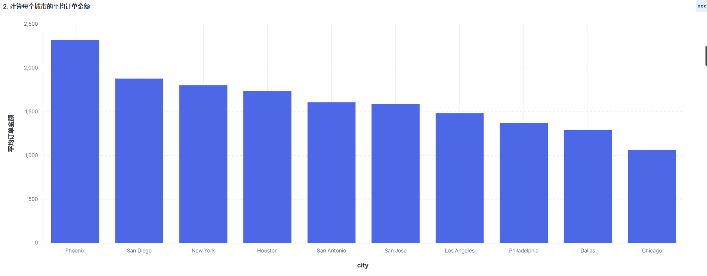

学院：省级示范性软件学院

课程：高级数据库技术与应用

题目：《实验五 Kibana操作》

姓名：焦买涛

学号：2200770114

班级：软工2203

日期：2024-11-8

实验环境： kibana-8.12.2  elasticsearch-8.12.2  Windows11  logstash-8.12.2


*** 

# 实验五 Kibana操作

## 一、实验目的

* 掌握Kibana操作

## 二、实验内容

* 使用Kibana完成的聚合操作10道题 
* 制作仪表盘

1. 统计每个产品类别的总销售额。


2. 计算每个城市的平均订单金额。
3. 找出销量最高的前5个产品。
4. 计算男性和女性客户的平均年龄。
5. 统计每种支付方式的使用次数和总金额。
6. 计算每月的总销售额。
7. 找出平均订单金额最高的前3个客户。
8. 计算每个年龄段（18-30，31-50，51+）的客户数量。
9. 计算每个产品类别的平均单价。
10. 找出订单数量最多的前5个城市。


### 题目：
1. 统计每个产品类别的总销售额。

```json
GET /ecommerce/_search
{
  "size": 0, // 不需要返回文档结果，只进行聚合
  "aggs": {
    "product_categories": {
      "terms": { // 使用terms聚合按字段的唯一值进行分组
        "field": "product_category", // 分组依据的字段
        "size": 10 // 返回前10个最常出现的分组
      },
      "aggs": {
        "total_sales": { // 对每个分组进行子聚合，计算总销售额
          "sum": { // 使用sum聚合计算总和
            "field": "total_amount" // 要计算总和的字段
          }
        }
      }
    }
  }
}
```


2. 计算每个城市的平均订单金额。

```json
GET /ecommerce/_search
{
  "size": 0,
  "aggs": {
    "average_order_amount_per_city": {
      "terms": {
        "field": "customer_city"
      },
      "aggs": {
        "average_order_amount": {
          "avg": {
            "field": "total_amount"
          }
        }
      }
    }
  }
}
```



3. 找出销量最高的前5个产品。

```json
GET /ecommerce/_search
{
  "size": 0,
  "aggs": {
    "top_5_products": {
      "terms": {
        "field": "product_id",
        "size": 5,
        "order": {
          "total_quantity": "desc"
        }
      },
      "aggs": {
        "total_quantity": {
          "sum": {
            "field": "quantity"
          }
        }
      }
    }
  }
}
```


4. 计算男性和女性客户的平均年龄。

```json
GET /ecommerce/_search
{
  "size": 0,
  "aggs": {
    "average_age_by_gender": {
      "terms": {
        "field": "customer_gender",
        "size": 2
      },
      "aggs": {
        "average_age": {
          "avg": {
            "field": "customer_age"
          }
        }
      }
    }
  }
}
```


5. 统计每种支付方式的使用次数和总金额。

```json
GET /ecommerce/_search
{
  "size": 0,
  "aggs": {
    "payment_methods": {
      "terms": {
        "field": "payment_method"
      },
      "aggs": {
        "count": {
          "value_count": {
            "field": "order_id"
          }
        },
        "total_amount": {
          "sum": {
            "field": "total_amount"
          }
        }
      }
    }
  }
}
```


6. 计算每月的总销售额。

```json
GET /ecommerce/_search
{
  "size": 0,
  "aggs": {
    "total_sales_per_month": {
      "date_histogram": {
        "field": "order_date",
        "calendar_interval": "month"
      },
      "aggs": {
        "total_sales": {
          "sum": {
            "field": "total_amount"
          }
        }
      }
    }
  }
}
```


7. 找出平均订单金额最高的前3个客户。

```json
GET /ecommerce/_search
{
  "size": 0,
  "aggs": {
    "top_customers_by_average_order_amount": {
      "terms": {
        "field": "customer_id",
        "size": 3,
        "order": {
          "average_order_amount": "desc"
        }
      },
      "aggs": {
        "average_order_amount": {
          "avg": {
            "field": "total_amount"
          }
        }
      }
    }
  }
}
```


8. 计算每个年龄段（18-30，31-50，51+）的客户数量。

```json
GET /ecommerce/_search
GET /ecommerce/_search
{
  "size": 0,
  "aggs": {
    "age_groups": {
      "range": {
        "field": "customer_age",
        "ranges": [
          { "from": 18, "to": 30 },
          { "from": 31, "to": 50 },
          { "from": 51, "to": 200 } // 使用一个足够大的数字来代替Infinity
        ]
      }
    }
  }
}
```


9.  计算每个产品类别的平均单价。

```json
GET /ecommerce/_search
{
  "size": 0, // 不返回搜索结果，仅执行聚合
  "aggs": {
    "average_price_per_category": {
      "terms": {
        "field": "product_category", // 按照产品类别字段进行分组
        "size": 10 // 指定返回的分组数量，这里设置为10，可以根据需要调整
      },
      "aggs": {
        "average_price": {
          "avg": { // 计算每个分组的平均值
            "field": "price" // 对应单价字段
          }
        }
      }
    }
  }
}
```


10. 找出订单数量最多的前5个城市。

```json
GET /ecommerce/_search
{
  "size": 0, // 不返回搜索结果，仅执行聚合
  "aggs": {
    "top_cities_by_order_count": {
      "terms": {
        "field": "customer_city", // 按照客户城市字段进行分组
        "size": 5, // 返回订单数量最多的前5个城市
        "order": {
          "_order_count": "desc" // 按照订单数量降序排列
        }
      },
      "aggs": {
        "_order_count": {
          "cardinality": { // 计算每个城市的订单数量（去重）
            "field": "order_id" // 对应订单ID字段
          }
        }
      }
    }
  }
}
```


### 制作仪表盘

总揽如下


http://localhost:5601/app/r/s/UCnUg

## 三、问题及解决办法


找老师


